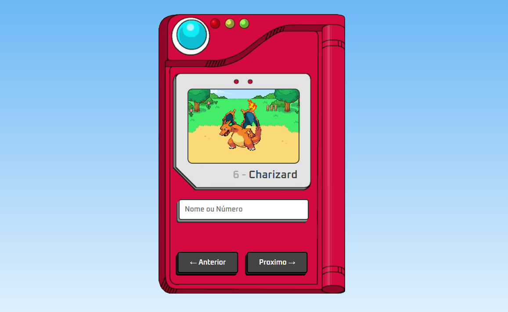

  

Este projeto foi desenvolvido com o objetivo de listar dados sobre pokemons, tal como seu nome, id e foto(gif), estes dados foram obtidos a partir da API REST [PokéApi](https://pokeapi.co). Para a construção deste projeto, foi utilizado as tecnologias HTML, CSS3 e Javascript, a partir de um tuturial disponivel neste [video](https://www.youtube.com/watch?v=SjtdH3dWLa8&t=2575s).

  

  

### Funcionalidades

- Busca de pokémons: Id e Nome
